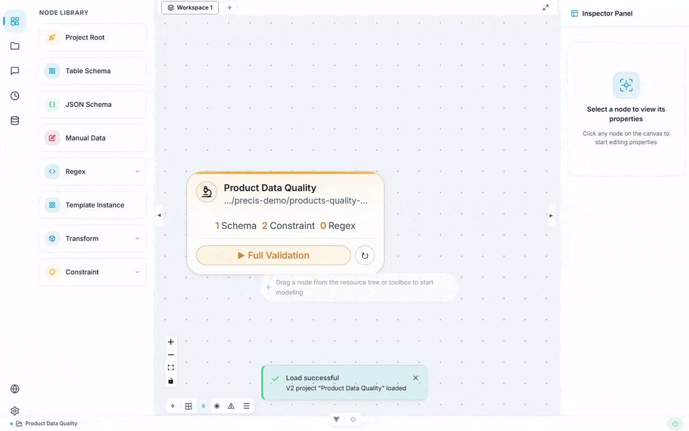

<div align="center">

# Precis

**本地优先的可视化数据质量工具 / Local-First Visual Data Quality Tool**

可视化建模 · 全链路校验 · 数据不出本机

[](https://github.com/AirSaiga/Precis)
[](LICENSE)
[](https://nodejs.org/)
[](https://python.org/)

[中文](#中文) · [English](#english)

</div>

> **Beta** — 核心功能稳定，V2 配置格式与 CLI/API 契约已冻结（只增不减）。生产关键数据建议保留备份。
> 欢迎通过 [Issues](https://github.com/AirSaiga/Precis/issues)、[Discussions](https://github.com/AirSaiga/Precis/discussions) 与 [Pull Request](https://github.com/AirSaiga/Precis/pulls) 参与贡献，贡献方式见 [CONTRIBUTING.md](CONTRIBUTING.md)。
>
> Beta stage. Core features are stable; the V2 config format and CLI/API contracts are frozen (additive changes only). Keep backups for production-critical data.
> Contributions are welcome via [Issues](https://github.com/AirSaiga/Precis/issues), [Discussions](https://github.com/AirSaiga/Precis/discussions), and Pull Requests — see [CONTRIBUTING.md](CONTRIBUTING.md) to get started.

---

<a name="中文"></a>

## 项目简介

Precis 是一款针对 Excel / CSV / TSV 表格数据的质量校验工具。校验流程在可视化画布上以节点和连线的方式编排——从数据接入、清洗转换到多维度质量检查，全程无需编写代码。所有数据均在本地处理，不上传至任何外部服务。

提供三种使用方式，按需选择：

- **桌面应用**（推荐）：图形界面，开箱即用
- **命令行**：适合批量执行，或交由 AI 编程助手（Kimi Code / Claude Code 等）调用
- **HTTP 接口**：用于集成到自有系统


## 功能特性

- **可视化编排** — 在画布上拖拽节点、连接流程，即可完成校验建模
- **10 种检查规则** — 必填校验、唯一性、引用完整性、允许值清单、数值范围、条件判断、自定义脚本、字符集、日期逻辑、多规则组合
- **22 种数据转换** — 字符串拆分、模式提取、数学计算、分组聚合、过滤、排序等
- **大文件支持** — 超大文件自动分块处理
- **本地运行** — 数据不出本机；中英文双语界面；桌面应用内置运行环境，安装即可使用

## 快速开始

### 环境要求

| 工具 | 版本 | 说明 |
|------|------|------|
| Node.js | `^20.19.0 \|\| >=22.12.0` | 含 npm |
| Python | `>=3.12,<3.14` | 3.12 或 3.13 |
| Rust | stable | 可选，仅构建终端界面时需要 |

<details>
<summary>如何确认本机版本</summary>

```bash
node --version          # 应 ≥ 20.19.0 或 ≥ 22.12.0
python3 --version       # 应为 3.12.x 或 3.13.x
```

若系统默认 `python3` 低于 3.12（macOS 自带 3.9），可通过 Homebrew 安装：

```bash
brew install python@3.12    # 安装后以 python3.12 调用
```

</details>

### 安装

```bash
git clone https://github.com/AirSaiga/Precis.git
cd Precis
npm run setup:mac              # macOS / Linux
# npm run setup:win            # Windows
```

一键脚本将依次完成：Python 环境检测、虚拟环境创建、依赖安装、前端与桌面应用构建。

> 无需图形界面、仅需在命令行或 AI 助手中执行校验，可直接 `pip install precis-cli` 获取 `precis` 命令；接入 AI 编程助手的方式见 [`integrations/`](integrations/README.md)。

<details>
<summary>开发者手动安装（含测试工具）</summary>

```bash
git clone https://github.com/AirSaiga/Precis.git
cd Precis

# 1. 安装前端依赖（根目录一次安装，覆盖全部子项目）
npm run install:all

# 2. 配置后端环境
cd backend
python3.12 -m venv .venv               # 若命令为 python3.13 则相应替换
source .venv/bin/activate              # Windows PowerShell: .venv\Scripts\Activate.ps1；Git Bash: source .venv/Scripts/activate
pip install --upgrade pip
pip install -e ".[dev]"                # 含 pytest / ruff / mypy 等开发工具
cd ..
```

> **注意**：凡调用 `python` 的 npm 脚本（`dev` / `backend:dev` / `cli` / `electron:dev`），执行前须先运行 `source backend/.venv/bin/activate`，否则将使用系统自带的低版本 Python。

</details>

### 启动

```bash
npm run electron:dev          # 桌面应用（推荐）：自动启动后端与前端
npm run dev                   # 开发模式：前后端分离运行，支持热更新
npm run cli                   # 纯命令行，不启动图形界面
npm run start:tui             # 终端界面（实验性，不随发布版本提供）
```

> 更多启动方式与脚本说明见 [`scripts/README.md`](scripts/README.md) 与 [`tui-rust/README.md`](tui-rust/README.md)。

### 验证安装

```bash
npm run cli:validate          # 使用内置示例数据（qa_test/qa_simple/）执行一次校验
```

正常输出校验结果即表示环境就绪。

## MCP Server（AI 助手直连）

本仓库实现了一个 [Model Context Protocol (MCP)](https://modelcontextprotocol.io) server（stdio 传输，基于官方 MCP Python SDK）。支持 MCP 的 AI 编程助手（Claude Code、Cursor、Kimi Code 等）配置后可直接调用校验引擎。

```bash
pip install "precis-cli[mcp]"     # 安装后获得 precis-mcp 命令
```

在 MCP 客户端中配置（`mcpServers` 格式，Claude Code / Cursor 等通用）：

```json
{
  "mcpServers": {
    "precis": {
      "command": "precis-mcp"
    }
  }
}
```

提供 4 个工具：

| 工具 | 作用 |
|------|------|
| `validate_data` | 执行校验，返回结构化错误报告（与 CLI `--format json` 同一契约） |
| `check_config` | 检查项目配置加载情况 |
| `describe_constraints` | 列出全部约束类型与参数说明 |
| `infer_schema` | 从数据文件推断 schema 草稿 |

更多 AI 助手接入方式（skill、插件包等）见 [`integrations/`](integrations/README.md)。

## 项目结构

```
Precis/
├── backend/        # 校验引擎与命令行
├── frontend/       # 可视化编辑器
├── electron/       # 桌面应用外壳
├── tui-rust/       # 终端界面
├── e2e/            # 自动化测试
├── qa_test/        # 内置示例数据
├── scripts/        # 构建与部署脚本
└── docs/           # 架构文档
```

## 更多文档

- **开发者**：开发命令与打包说明见 [CONTRIBUTING.md](CONTRIBUTING.md)；架构细节见 [AGENTS.md](AGENTS.md) 与 [docs/ARCHITECTURE.md](docs/ARCHITECTURE.md)
- [CHANGELOG.md](CHANGELOG.md) — 变更日志
- [SECURITY.md](SECURITY.md) — 安全说明
- 各子项目详情：[backend](backend/README.md) · [frontend](frontend/README.md) · [electron](electron/README.md) · [tui-rust](tui-rust/README.md) · [scripts](scripts/README.md) · [e2e](e2e/README.md)

## 许可证

[Apache-2.0](LICENSE) — 详见 [LICENSE_NOTICE.md](LICENSE_NOTICE.md)。

---

<a name="english"></a>

## Overview

Precis is a data quality tool for Excel / CSV / TSV tabular data. Validation workflows are composed on a visual canvas using nodes and connections — from data ingestion and transformation to multi-dimensional quality checks, without writing any code. All data is processed locally and never uploaded to any external service.

Three usage modes, choose as needed:

- **Desktop app** (recommended): graphical interface, ready out of the box
- **Command line**: suitable for batch execution, or for invocation by AI coding assistants (Kimi Code / Claude Code, etc.)
- **HTTP API**: for integration into your own systems



## Features

- **Visual composition** — build validation workflows by arranging nodes and connections on a canvas
- **10 check rules** — required values, uniqueness, referential integrity, allowed value lists, numeric ranges, conditional checks, custom scripts, character sets, date logic, and multi-rule combinations
- **22 data transforms** — string splitting, pattern extraction, math evaluation, grouping and aggregation, filtering, sorting, and more
- **Large file support** — oversized files are automatically processed in chunks
- **Runs locally** — data never leaves your machine; bilingual Chinese/English interface; the desktop app bundles its runtime and works immediately after installation

## Quick Start

### Prerequisites

| Tool | Version | Notes |
|------|---------|-------|
| Node.js | `^20.19.0 \|\| >=22.12.0` | includes npm |
| Python | `>=3.12,<3.14` | 3.12 or 3.13 |
| Rust | stable | optional, only required to build the terminal UI |

<details>
<summary>How to check your local versions</summary>

```bash
node --version          # should be ≥ 20.19.0 or ≥ 22.12.0
python3 --version       # should be 3.12.x or 3.13.x
```

If the system default `python3` is older than 3.12 (macOS ships 3.9), install one via Homebrew:

```bash
brew install python@3.12    # invoke as python3.12 after installation
```

</details>

### Installation

```bash
git clone https://github.com/AirSaiga/Precis.git
cd Precis
npm run setup:mac              # macOS / Linux
# npm run setup:win            # Windows
```

The setup script performs, in order: Python detection, virtual environment creation, dependency installation, and frontend / desktop app build.

> If you only need validation from the command line or an AI assistant, run `pip install precis-cli` to get the `precis` command; see [`integrations/`](integrations/README.md) for AI coding assistant integration.

<details>
<summary>Manual install for developers (includes test tools)</summary>

```bash
git clone https://github.com/AirSaiga/Precis.git
cd Precis

# 1. Install frontend dependencies (single root install covering all sub-projects)
npm run install:all

# 2. Set up the backend environment
cd backend
python3.12 -m venv .venv               # substitute python3.13 if that is your command
source .venv/bin/activate              # Windows PowerShell: .venv\Scripts\Activate.ps1; Git Bash: source .venv/Scripts/activate
pip install --upgrade pip
pip install -e ".[dev]"                # includes pytest / ruff / mypy and other dev tools
cd ..
```

> **Note**: any npm script that invokes `python` (`dev` / `backend:dev` / `cli` / `electron:dev`) requires `source backend/.venv/bin/activate` first; otherwise the system's older Python will be used.

</details>

### Launch

```bash
npm run electron:dev          # Desktop app (recommended): starts backend and frontend automatically
npm run dev                   # Dev mode: backend and frontend run separately with hot reload
npm run cli                   # Command line only, no graphical interface
npm run start:tui             # Terminal UI (experimental, not included in releases)
```

> Additional launch options and script details: [`scripts/README.md`](scripts/README.md) and [`tui-rust/README.md`](tui-rust/README.md).

### Verify the Installation

```bash
npm run cli:validate          # runs a validation pass on the bundled sample data (qa_test/qa_simple/)
```

Successful validation output indicates the environment is ready.

## MCP Server (for AI assistants)

This repository implements a [Model Context Protocol (MCP)](https://modelcontextprotocol.io) server over stdio, built on the official MCP Python SDK. MCP-capable AI coding assistants (Claude Code, Cursor, Kimi Code, etc.) can call the validation engine directly once configured.

```bash
pip install "precis-cli[mcp]"     # provides the precis-mcp command
```

Client configuration (`mcpServers` format, works with Claude Code / Cursor and others):

```json
{
  "mcpServers": {
    "precis": {
      "command": "precis-mcp"
    }
  }
}
```

Four tools are exposed:

| Tool | Purpose |
|------|---------|
| `validate_data` | Run validation, returning a structured error report (same contract as CLI `--format json`) |
| `check_config` | Check project configuration loading |
| `describe_constraints` | List all constraint types and their parameters |
| `infer_schema` | Infer a schema draft from a data file |

More AI assistant integration options (skills, plugin packages): [`integrations/`](integrations/README.md).

## Project Structure

```
Precis/
├── backend/        # Validation engine and command line
├── frontend/       # Visual editor
├── electron/       # Desktop app shell
├── tui-rust/       # Terminal interface
├── e2e/            # Automated tests
├── qa_test/        # Bundled sample data
├── scripts/        # Build and deployment scripts
└── docs/           # Architecture documentation
```

## More Documentation

- **Developers**: dev commands and packaging notes in [CONTRIBUTING.md](CONTRIBUTING.md); architecture details in [AGENTS.md](AGENTS.md) and [docs/ARCHITECTURE.md](docs/ARCHITECTURE.md)
- [CHANGELOG.md](CHANGELOG.md) — Changelog
- [SECURITY.md](SECURITY.md) — Security notes
- Per-project details: [backend](backend/README.md) · [frontend](frontend/README.md) · [electron](electron/README.md) · [tui-rust](tui-rust/README.md) · [scripts](scripts/README.md) · [e2e](e2e/README.md)

## License

[Apache-2.0](LICENSE) — See [LICENSE_NOTICE.md](LICENSE_NOTICE.md) for details.
